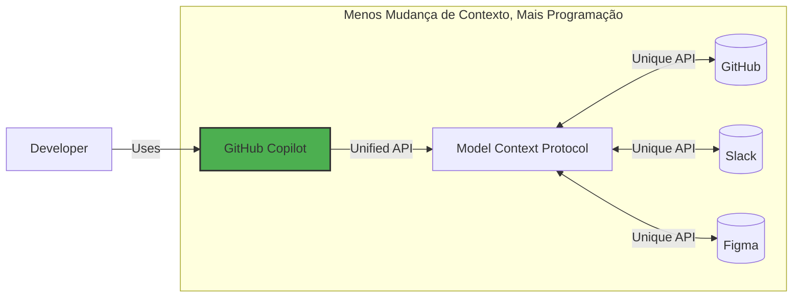

## Passo 1: Introdução ao MCP e configuração do ambiente


No exercício [Primeiros Passos com GitHub Copilot](https://github.com/skills/getting-started-with-github-copilot), fomos apresentados ao site de atividades extracurriculares da Mergington High School, que permitia aos estudantes se inscreverem em eventos.

E agora temos um problema... mas... é um bom problema! Mais professores estão pedindo para usá-lo! 🎉

Nossos colegas professores têm muitas ideias, mas parece que não conseguimos acompanhar todas as solicitações! 😮 Para resolver esse problema, vamos dar um upgrade ao GitHub Copilot habilitando o Model Context Protocol (MCP). Para ser mais específico, vamos adicionar o servidor GitHub MCP, que habilitará um fluxo de trabalho combinado de gerenciamento de issues e upgrades do site. 🧑‍🚀

Vamos começar!

### O que é Model Context Protocol (MCP)?

[Model Context Protocol (MCP)](https://modelcontextprotocol.io/introduction) é frequentemente chamado de "USB-C para IA" - um conector universal que permite ao GitHub Copilot (e outras ferramentas de IA) interagir perfeitamente com outros serviços.

Essencialmente, é uma forma de descrever as capacidades e requisitos de um serviço, para que ferramentas de IA possam facilmente determinar quais métodos usar e fornecer os parâmetros com precisão. Um servidor MCP está fornecendo essa interface.



### :keyboard: Atividade: Conheça seu ambiente

Antes de mergulharmos no MCP, vamos iniciar nosso ambiente de desenvolvimento e nos refamiliarizar com a aplicação de atividades extracurriculares.

1. Clique com o botão direito no botão abaixo para abrir a página **Criar Codespace** em uma nova aba. Use a configuração padrão.

   [](https://codespaces.new/{{full_repo_name}}?quickstart=1)

1. Valide se as extensões **Copilot Chat** e **Python** estão instaladas e habilitadas.

   <br/>
   

1. Verifique se nossa aplicação roda antes da modificação. Na barra lateral esquerda, selecione a aba **Executar e Depurar** e então pressione o ícone **Iniciar Depuração**.

   <details>
   <summary>📸 Mostrar captura de tela</summary><br/>

   

   </details>

   <details>
   <summary>🤷 Tendo problemas?</summary><br/>

   Se a área **Executar e Depurar** estiver vazia, tente recarregar o VS Code: Abra a paleta de comandos (`Ctrl`+`Shift`+`P`) e procure por `Developer: Reload Window`.

   

   </details>

1. Use a aba **Portas** para encontrar o endereço da página web, abra-a e verifique se está funcionando.

   <details>
   <summary>📸 Mostrar captura de tela</summary><br/>

   

   

   </details>

### :keyboard: Atividade: Adicionar o servidor GitHub MCP

1. Dentro do seu codespace, abra o painel **Copilot Chat** e verifique se o modo **Agente** está selecionado.

   

   <details>
   <summary>Modo Agente ausente?</summary><br/>

   - Verifique se o VS Code está pelo menos na versão `v1.99.0`.
   - Verifique se a extensão Copilot está pelo menos na versão `v1.296.0`.
   - Verifique se o modo Agente está habilitado nas suas [configurações de usuário ou workspace](https://code.visualstudio.com/docs/configure/settings#_workspace-settings).

      

   </details>

1. Dentro do seu codespace, navegue até a pasta `.vscode` e crie um novo arquivo chamado `mcp.json`. Cole o seguinte conteúdo:

   📄 **.vscode/mcp.json**

   ```json
   {
     "servers": {
       "github": {
         "type": "http",
         "url": "https://api.githubcopilot.com/mcp/"
       }
     }
   }
   ```

1. No arquivo `.vscode/mcp.json`, clique no botão **Iniciar** e aceite o prompt para autenticar com o GitHub. Isso acabou de informar o GitHub Copilot sobre as capacidades do servidor MCP.

   

   <br/>

   

1. No painel lateral do Copilot, clique no **ícone 🛠️** para mostrar as capacidades adicionais.

   

   

1. **Faça commit** e **push** do arquivo `.vscode/mcp.json` para a branch `main`.

   > 🪧 **Nota:** Fazer push diretamente para `main` não é uma prática recomendada. É apenas para simplificar este exercício.

1. Agora que sua configuração do servidor MCP foi enviada para o GitHub, a Mona já deve estar ocupada verificando seu trabalho. Dê um momento para ela e fique de olho nos comentários. Você verá ela responder com informações de progresso e a próxima lição.

> [!NOTE]
> Os próximos passos envolverão criar issues do GitHub. Se você quiser evitar emails de notificação, pode parar de acompanhar o repositório.

<details>
<summary>Tendo problemas?</summary><br/>

Certifique-se de que:

- Seu arquivo `.vscode/mcp.json` é similar ao exemplo fornecido.
- Você fez push das mudanças para a branch `main`.

</details>
